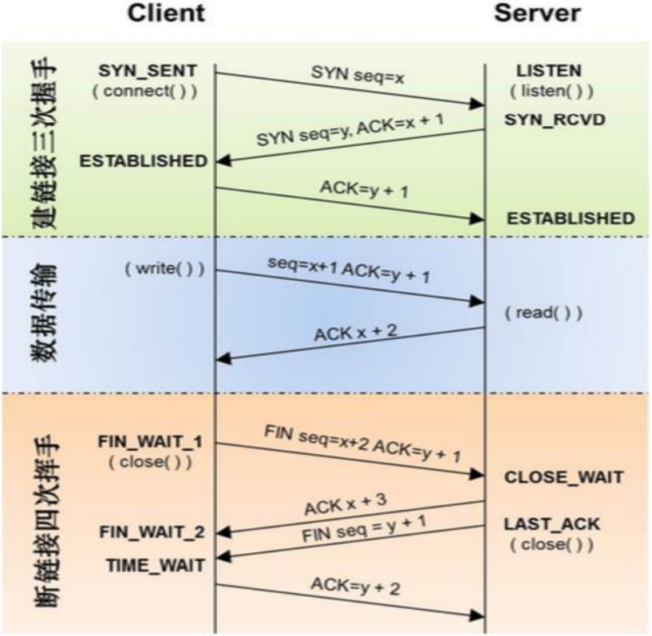

# 企业笔试题

1. TCP总结

   TCP客户端的创建流程:

   1. 创建TCP的socket套接字
   2. 连接服务器
   3. 发送数据给服务端
   4. 接收服务器端发送来的消息
   5. 关闭套接字

   ```python
   import socket
   def main():
   	# 1、创建客户端的 socket
   	# socket.AF_INET 表示 IPv4 协议 AF_INET6 表示 IPv6 协议
   	# socket.SOCK_STREAM 流式套接字，只要用于 TCP 协议
   	client_socket = socket.socket(socket.AF_INET, socket.SOCK_STREAM)
   	# 2、构建目标地址
   	server_ip = input("请输入服务器端的 IP 地址：")
   	server_port = int(input("请输入服务器端的端口号："))
   	# 3、连接服务器
   	# 参数：元组类型 ip 是字符串类型 端口号是整型
   	client_socket.connect((server_ip, server_port))
   	# 要发送给服务器端的数据
   	send_data = "我是要发送给服务器端的数据" 15． # 4、发送数据
   	client_socket.send(send_data.encode("gbk"))
   	# 5、接收服务器端恢复的消息， 没有消息会阻塞
   	# 1024 表示接收的最大字节数
   	recv_date= client_socket.recv(1024)
   	print("接收到的数据是：", recv_date.decode('gbk'))
   	# 6、关闭套接字
   	client_socket.close()
   if __name__ == '__main__':
   	main()
   ```

   TCP 服务器端的创建流程

   1. 创建 TCP 服务端的 socket
   2. bing 绑定 ip 地址和端口号
   3. listen 使套接字变为被动套接字
   4. accept 取出一个客户端连接，用于服务
   5. recv/send 接收和发送消息
   6. 关闭套接字

   ```python
   import socket

   def main():
   	# 1、创建 tcp 服务端的 socket
   	server_socket = socket.socket(socket.AF_INET, socket.SOCK_STREAM)

   	# 2、绑定
   	server_socket.bind(('', 8888))

   	# 3、listen 使套接字变为被动套接字
   	server_socket.listen(128)

   	# 4、如果有新的客户端来链接服务器，那么就产生一个新的套接字专门为这个客户端服务
   	# client_socket 用来为这个客户端服务
   	# tcp_server_socket 就可以省下来专门等待其他新客户端的链接
   	client_socket, client_addr = server_socket.accept()

   	# 5、接收客户端发来的消息
   	recv_data = client_socket.recv(1024)
   	print("接收到客户端%s 的数据：%s" % (str(client_addr), recv_data.decode('gbk')))

   	# 6、回复数据给客户端
   	client_socket.send("收到消息".encode('gbk'))

   	# 7、关闭套接字
   	client_socket.close()
   	server_socket.close()

   if __name__ == '__main__':
   	main()
   ```

   注意点：

   - tcp 服务器一般都需要绑定，否则客户端找不到服务器
   - tcp 客户端一般不绑定，因为是主动链接服务器，所以只要确定好服务器的 ip、port 等信息就好，

   本地客户端可以随机

   - tcp 服务器中通过 listen 可以将 socket 创建出来的主动套接字变为被动的，这是做 tcp 服务器

   时必须要做的

   - 当客户端需要链接服务器时，就需要使用 connect 进行链接，udp 是不需要链接的而是直接发

   送，但是 tcp 必须先链接，只有链接成功才能通信

   - 当一个 tcp 客户端连接服务器时，服务器端会有 1 个新的套接字，这个套接字用来标记这个客户

   端，单独为这个客户端服务

   - listen 后的套接字是被动套接字，用来接收新的客户端的连接请求的，而 accept 返回的新套接

   字是标识这个新客户端的

   - 关闭 listen 后的套接字意味着被动套接字关闭了，会导致新的客户端不能够链接服务器，但是之

   前已经链接成功的客户端正常通信。

   - 关闭 accept 返回的套接字意味着这个客户端已经服务完毕
   - 当客户端的套接字调用 close 后，服务器端会 recv 解阻塞，并且返回的长度为 0，因此服务器可

   以通过返回数据的长度来区别客户端是否已经下线；同理 当服务器断开 tcp 连接的时候 客户端
   同样也会收到 0 字节数据。

   ​

2. 怎么实现强行关闭客户端和服务器之间的连接?

   在 socket 通信过程中不断循环检测一个全局变量(开关标记变量)，一旦标记变量变为关闭，则 调
   用 socket 的 close 方法，循环结束，从而达到关闭连接的目的。

   ​

3. **简述 TCP 优缺点?**

   - TCP 是面向连接的通讯协议，通过三次握手建立连接，通讯完成时四次挥手

   优点：TCP 在数据传递时，有确认、窗口、重传、阻塞等控制机制，能保证数据正确性，较为可靠。
   缺点：TCP 相对于 UDP 速度慢一点，要求系统资源较多。

   ​

4. 请简单说一下三次握手和四次挥手？

   

   - 三次握手过程：

   1 首先客户端向服务端发送一个带有 SYN 标志，以及随机生成的序号 100(0 字节)的报文
   2 服务端收到报文后返回一个报文(SYN200(0 字节)，ACk1001(字节+1))给客户端
   3 客户端再次发送带有 ACk 标志 201(字节+)序号的报文给服务端
   至此三次握手过程结束，客户端开始向服务端发送数据。

   1 客户端向服务端发起请求：我想给你通信，你准备好了么？
   2 服务端收到请求后回应客户端：I'm ok，你准备好了么
   3 客户端礼貌的再次回一下客户端：准备就绪，咱们开始通信吧！
   整个过程跟打电话的过程一模一样:1 喂，你在吗 2 在，我说的你听得到不 3 恩，听得到(接下来请
   开始你的表演)
   补充：SYN：请求询问，ACk：回复，回应。

   - 四次挥手过程：

   由于 TCP 连接是可以双向通信的（全双工），因此每个方向都必须单独进行关闭（这句话才是
   精辟，后面四个挥手过程都是其具体实现的语言描述）
   四次挥手过程，客户端和服务端都可以先开始断开连接
   1 客户端发送带有 fin 标识的报文给服务端，请求通信关闭
   2 服务端收到信息后，回复 ACK 答应关闭客户端通信(连接)请求
   3 服务端发送带有 fin 标识的报文给客户端，也请求关闭通信
   4 客户端回应 ack 给服务端，答应关闭服务端的通信(连接)请求

   ​

