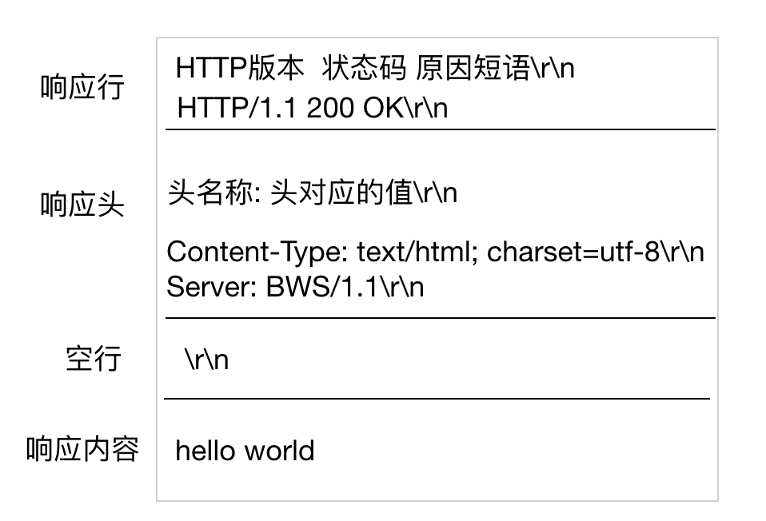

# 每日练习题

1. 什么是域名?

   我们在访问一台服务器的时候, 需要记住该服务器的IP地址, 由于IP地址不利于人们记忆, 所以推出的域名技术. 域名是由一串用点分隔的名字组成的 Internet 上某一台计算机或计算机组的名称, 用于在数据传输时标识计算机的位置.

   ​

2. 什么是DNS?

   由于我们用域名来标识计算机的位置, 但是我们前面讲过, 网络上标识主机的唯一标识是IP地址, 所以就需要记录一下, 一个域名和IP地址的对应关系, 这个对应关系就存储在DNS服务器中, 当我们向DNS发出请求时, DNS会返回给我们域名所对应的IP地址.

   ​

3. 浏览器的开发者工具常用功能有哪些?

   - 元素(Elements):用于查看或修改HTML元素的属性、CSS属性、监听事件、断点等.
   - 控制台(Console):控制台一般用于执行一次性代码, 查看JavaScript对象, 查看调试日志信息或异常信息.
   - 源代码(Sources):该页面用于查看页面的HTML文件源代码、JavaScript源代码、CSS源代码, 此外最重要的是可以调试JavaScript源代码, 可以给JS代码添加断点等.
   - 网络(Network):网络页面主要用于查看 header 等与网络连接相关的信息.

   ​

4. http请求报文分为几部分?第一行有几部分?分别代表什么?

   四部分：请求行、请求头、空行、请求体

   请求行：包含请求方法、资源路径、HTTP协议及版本

   请求头：请求的附加信息

   空行：分隔请求头与请求体（格式）

   请求体：发送请求时携带的参数

   ​

5. 常用头部及其含义

   - Host 表示浏览器要请求的主机地址. 这是我们查看下 baidu.com flowercpp.cn， 请求不同的网站, 会有不同的主机地址.

   - Connection 表示浏览器和服务器之间的连接方式, 浏览器和服务器连接是长连接还是短连接, 稍后会讲解.

   - User-Agent 用户代理, 我们使用谷歌浏览器和火狐浏览器分别请求百度, 那么会发现 User-Agent 的值是不一样的, 它主要是用于浏览器告诉服务器自己的身份, 比如浏览器端使用的操作系统是什么版本, 浏览器是什么版本等等. 服务器端为什么需要知道这个信息呢? 我们后面会讲到爬虫，爬虫程序主要是从服务器端获取数据, 那么服务器端就会有反爬机制, 服务器不希望爬虫来获取数据, 所以通过该项可以知道客户端是否是爬虫程序. 如果爬虫程序想伪装成一个浏览器的请求, 就必须设置此项.

   - Accept 表示浏览器告诉服务器, 自己能够接收并识别的文件类型.

   - Accept-Encoding 表示浏览器能够处理的压缩方式. 为什么需要压缩呢？ 当网页数据量大的时候, 压缩之后可以提高传输速率, 提高用户体验.

   - Accept-Language 浏览器可以接收的文本语言, 如果非中文编码可能会出现乱码.

     （多动手自查）

     ​

6. TCP短连接的通信过程

   1. client 向 server 发起连接请求
   2. server 接到请求，双方建立连接
   3. client 向 server 发送消息
   4. server 回应 client
   5. 一次读写完成，此时双方任何一个都可以发起 close 操作

   ​

7. TCP长连接通信过程

   1. client 向 server 发起连接

   2. server 接到请求，双方建立连接

   3. client 向 server 发送消息

   4. server 回应 client

   5. 一次读写完成，连接不关闭

   6. 后续读写操作...

   7. 长时间操作之后client发起关闭请

      ​

8. TCP长/短连接的优缺点

   - 长连接可以省去较多的TCP建立和关闭的操作，节约时间。但是如果用户量太大容易造成服务器负载过高最终导致服务不可用。

   - 短连接对于服务器来说实现起来较为简单，存在的连接都是有用的连接，不需要额外的控制手段。但是如果用户访问量很大, 往往可能在很短时间内需要创建大量的连接，造成服务器响应速度过慢。

   总之,

   - 小的WEB网站的http服务一般都用短链接，因为长连接对于服务端来说会耗费一定的资源来让套接字 保持存活-keep alive，
   - 对于中大型WEB网站一般都采用长连接，好处是响应用户请求的时间更短，用户体验更好，虽然更耗硬件资源一些，但这都不是事儿。另外，数据库的连接用长连接，如果用短连接频繁的通信会造成socket错误。

   ​

9. GET请求格式

   GET / HTTP/1.1\r\n

   Host:lacalhost:8888\r\n

   \r\n

   name=abc&age=80

   ​

10. POST请求格式

   POST  / HTTP/1.1\r\n

   Host:lacalhost:8888\r\n

   \r\n

   b'image_content'

   ​

11. **掌握电脑访问百度的过程(画出访问流程以及说出每一步的工作内容)**

    

    1. 用户输入网址.
    2. 浏览器请求DNS服务器, 获取域名对应的IP地址.
    3. 请求连接该IP地址服务器.
    4. 发送资源请求. (HTTP协议)
    5. web服务器接收到请求, 并解析请求, 判断用户意图.
    6. 获取用户想要的资源.
    7. 将资源返回给web服务器程序.
    8. web服务器程序将资源数据通过网络发送给浏览器.
    9. 浏览器解析请求的数据并且完成网页数据的显示.

    ​

12. **常见的状态码及其说明**

    200 OK，服务器正常返回响应报文

    302 redirect, 我们通过 302 状态码可以指示浏览器跳转到某一个 URL

    404 NOT FOUND, 当我们访问一个不存在的 URL 时, 一般会返回404状态码, 告诉浏览器, 你访问的 URL 是不存在的

    500 Internal Server Error, 服务器遇到了一个未曾预料的状况, 导致了它无法完成对请求的处理. 一般来说, 这个问题都会在服务器端的源代码出现错误时出现

    ​

13. **请求报文格式是什么样的**

    

    ​

14. **响应报文格式是什么样的**

    

    ​

15. 练习用代码实现模拟浏览器

    ​略，参考课件

