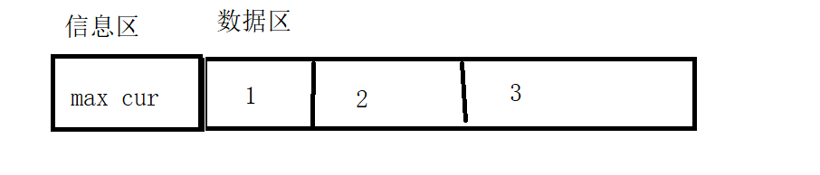

# 数据结构和算法

**数据结构**

存储和组织数据的方式

**算法**

解决问题的思路或方式

不依赖代码,python c java

# 算法

解决问题的思想

```
①输入: 算法具有0个或多个输入
②输出: 算法至少有1个或多个输出
③有穷性: 算法在有限的步骤之后会自动结束而不会无限循环，并且每一个步骤可以在可接受的时间内完成
④确定性：算法中的每一步都有确定的含义，不会出现二义性
⑤可行性：算法的每一步都是可行的，也就是说每一步都能够执行有限的次数完成
```

# 算法的时间效率衡量标准

**能不能使用执行时间衡量?**

1. 不同的硬件运行时间运行时间相差比较大,外部环境影响比较大

2. 随着问题规模的变化,时间不能反映算法的效率

   y = 10n  y=n**2  10  1  20 4

**增长趋势**

固定操作*步骤

# 时间复杂度

时间复杂度指的是程序执行时间随着问题规模变化执行时间变化趋势,渐进时间复杂度

y=2n  y=n**2 y = 1000  y = 10000

**时间复杂度表示**

O(公式)

只关注变化趋势最大部分,3*n**3  O(n**3)

```
#                 # ②判断是否满足条件
#                 if a ** 2 + b ** 2 == c ** 2 and a + b + c == 1000:
#                     print("a b c:", a, b, c)
# 
# O(n^3)


# def find2(n):
#     # ①列举a, b, c的所有可能的数值
#     for a in range(0, n):
#         for b in range(0, n):
#             c = 1000 - a - b
#             # ②判断是否满足条件
#             if a ** 2 + b ** 2 == c ** 2:
#                 print("a b c:", a, b, c)
# O(n**2)
```

# 时间复杂度计算

1. 基本操作时间复杂度O(1)

   ```python
   def func():
       a = 10
       b = 20
       sum = a+b
       for i in range(100000):
           print(i)
   ```

2. 顺序结构 时间复杂度按加法计算

   ```python
   def func(n):
       a = 10
       b = 20
       sum = a+b
       for i in range(n):
           print(i)
       for i in range(n):
           for j in range(n//2):
               print(j)
   ```

3. 循环结构 乘法运算

4. 分支结构  取最大值

   ```python
   def func(n):
       if n%2==0:#O(n)
           for i in range(n):
               print(i)
       else:# O(n**2)
           for i in range(n):
               for j in range(n):
                   print(j)
               
   ```

5. 可以忽略常数项和次要项

6. 函数嵌套时间复杂度

   ```python
   def f(n):
       sum = 0
       for i in range(1, n):
           sum += i
       return sum
   
   def cal(n):
       ret = 0
       for i in range(1, n):
           ret += f(i)
   
   ```

7. 多个变量的时间复杂度

   ```python
   def func(m,n):
       for i in range(m):
           print(i)
           
       for j in range(n):
           print(j)
   ```

   O(m+n)   

# 最优最坏时间复杂度

**最优时间复杂度**

最乐观情况下,实现功能需要的最小步骤

**最坏时间复杂度**

最悲观情况下,实现功能需要的最小步骤,提供了一种保证

# 常见时间复杂度

O(1)

O(logn)  

O(n)

O(n*logn)

O(n*n)

# 空间复杂度

内存空间随着数据规模的变化的变化趋势,渐进空间复杂度 简称空间复杂度

O(1)

O(n)

# 数据结构

存储和组织数据的方式

算法解决问题的思路

# 内存

申请内存最小单位是字节byte

# 线性结构和非线性结构

线性结构:
线性结构就是表中各个结点具有线性关系

队列和栈  链表

非线性结构:
非线性结构就是表中各个结点之间具有多个对应关系

树 图

# 线性结构存储方式

**顺序表**

元素存储在一段连续的内存空间

可以通过索引方式访问元素

**分类**

1. 一体式 信息区和数据区在一起

2. 分离式 信息区和数据区分开

   

**元素外置**

数据区中存储的是元素的内存地址,不是保存具体的元素

python的列表是分离式顺序表实现的 元素外置

python大部分数据元素外置

**链表**

存储在一段非连续空间,当前元素保存下一个元素的指向

# 顺序表扩容

**组成部分**

1. 信息区 信息描述  最大容量 当前占用大小
2. 数据区 数据(也包括元素外置)

**扩容**

如果连续的内存空间足够,直接扩容

如果后面没有足够的连续内存空间,需要迁移

扩容之后内存地址有可能发生变化

**扩容方法**

1. 每次增加固定的个数
2. 每次增加倍数

# 顺序表操作

**增加**

1. 尾部增加 O(1)
2. 特定位置非保序O(1)
3. 特定位置保序O(n)

**删除**

1. 删除尾部O(1)
2. 删除特定位置非保序O(1)
3. 删除特定位置保序O(n)

**查找**

1. 按照角标查找O(1)
2. 查找元素最优O(1) 最坏O(n)

**修改**

1. 按照角标查找O(1)
2. 查找元素最优O(1) 最坏O(n)


# 链表

**链表元素**

包含两个部分:数据  下一个元素的指向

类:数据data 下一个元素指向next

**链表**

头结点属性:head

## 链表的实现

```python
# 链表结点实现
class SingleNode(object):
    def __init__(self, item):
        # item: 存放元素
        self.item = item
        # next: 标识下一个结点
        self.next = None

# 单链表的实现
class SingleLinkList(object):
    def __init__(self, node=None):
        # head: 首节点
        self.head = node
# 结点
node1 = SingleNode(10)
print(node1.item)
print(node1.next)
# 链表
link1 = SingleLinkList()
print(link1.head)
link2 = SingleLinkList(node1)
print(link2.head.item)        
```

## 链表的基本操作

**判断是否为空**

```python
# 单链表的实现
class SingleLinkList(object):
    def __init__(self, node=None):
        # head: 首节点
        self.head = node

# 判断链表是否为空
    def is_empty(self):
        # if self.head is None:
        if not self.head:
            return True
        else:
            return False
```

> 是否头结点为空

**长度判断**

```python
# 单链表的实现
class SingleLinkList(object):
    def __init__(self, node=None):
        # head: 首节点
        self.head = node

...
# 获取链表长度
    def length(self):
        # 游标记录当前所在的位置
        cur = self.head
        # 记录链表的长度
        count = 0

        # while cur is not None:
        while cur:
            cur = cur.next
            count += 1

        return count
```

> 从头开始判断节点是否为空,不为空,计数加1

**链表遍历**

```python
# 单链表的实现
class SingleLinkList(object):
    def __init__(self, node=None):
        # head: 首节点
        self.head = node

...
# 遍历链表
    def travel(self):
        # 游标记录当前所在的位置
        cur = self.head

        # while cur is not None:
        while cur:
            print(cur.item)
            cur = cur.next
```

> 从头结点开始 找下一个节点 节点不为空,打印节点中的item数据

## 增加元素

**头部增加**

```python
# 头部增加结点
    def add(self, item):
        # 新结点存储新数据
        node = SingleNode(item)
        node.next = self.head
        self.head = node
```

**尾部添加**

```python
# 尾部增加结点
    def append(self, item):
        # 新结点存储新数据
        node = SingleNode(item)

        # 判断是否是空链表
        if self.is_empty():
            self.head = node
            return
        # else:
        cur = self.head
        # 找到尾结点
        # while cur.next is not None:
        while cur.next:
            cur = cur.next
        # 把最后一个节点的next指向当前创建的节点
        cur.next = node
```

**特定位置添加**

```python
 def insert(self, pos, item):
        # 头部增加新结点
        if pos <= 0:
            self.add(item)
            return 
        # 尾部添加
        if pos >= self.length():
            self.append(item)
            return 
        # 特定位置添加数据
        # 游标
        cur = self.head
        # 计数
        count = 0
        # 新结点
        node = SingleNode(item)

        # 1找到插入位置的前一个结点
        while count < pos - 1:
            cur = cur.next
            count += 1

        # 2完成插入新结点
        node.next = cur.next
        cur.next = node
```

> 如果索引小于等于0,在头部添加
>
> 索引大于链表的长度  在尾部添加
>
> 在中间位置添加:找添加的位置前一个节点

## 删除元素

```python
def remove(self, item):
        # 游标
        cur = self.head
        # 辅助游标
        pre = None

        while cur is not None:
            # 找到了要删除的元素
            if cur.item == item:
                # 要删除的元素在头部
                if cur == self.head:
                    self.head = cur.next
                else:
                    pre.next = cur.next
                return
            # 没有找到要删除的元素
            pre = cur
            cur = cur.next
```

> 查找节点中的数据item是否和删除的item相同
>
> 相同,判断如果是首节点,直接改变head的指向后一个节点
>
> 没有找到,需要next  
>
> 需要借助pre变量保存上一个节点

## 链表查询元素

```python
   def search(self, item):
        # 游标
        cur = self.head

        while cur is not None:
            # 找到了指定的结点
            if cur.item == item:
                return True
            cur = cur.next

        return False
```

# 链表和顺序表

**顺序表**

存储在一段连续内存空间

增加(头部、尾部、任意位置)

删除(尾部、任意位置)

查找:1. 索引 2.元素

**链表**

不需要存储在连续的内存空间

增加(头部、尾部、任意位置)

删除(尾部、头部、任意位置)

查找:元素

**优缺点**

顺序表:

优点:查找快

缺点:需要连续内存空间 删除元素  需要数据搬迁

链表

优点:可以不需要连续内存空间 减少删除数据时的数据搬迁

缺点:查找速度慢  增加存储空间


