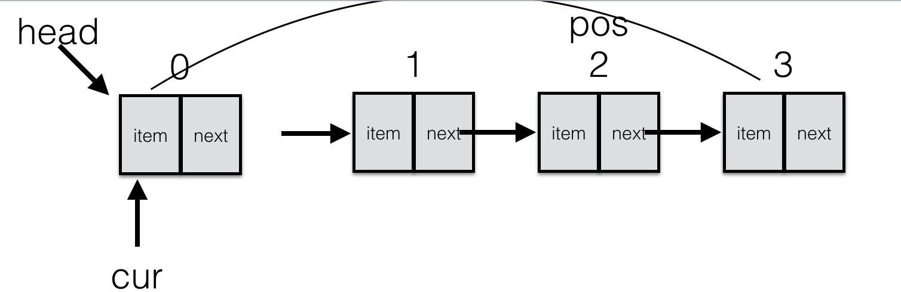

# 企业面试题

1. 自己实现单向循环链表  并实现以下功能

   > - is_empty() 链表是否为空
   > - length() 链表长度
   > - travel() 遍历整个链表
   > - add(item) 链表头部添加元素
   > - append(item) 链表尾部添加元素
   > - insert(pos, item) 指定位置添加元素
   > - remove(item) 删除节点
   > - search(item) 查找节点是否存在 

**链表示意图如下:**



   ```python
   class Node(object):
       """结点类"""
   
       def __init__(self, item):
           self.item = item
           self.next = None
   ```

   ```python
   class CycleSingleLinkList(object):
       """单向循环链表"""
   
       def __init__(self, node=None):
           self.__head = node
   
       def is_empty(self):
           """链表是否为空
           :return 如果链表为空 返回真
           """
           return self.__head is None
   
       def length(self):
           """链表长度"""
           if self.is_empty():
               return 0
           cur = self.__head
           count = 1
           while cur.next != self.__head:
               count += 1
               cur = cur.next
           return count
   
       def travel(self):
           """遍历整个链表"""
           if self.is_empty():
               print("")
               return
           cur = self.__head
           while cur.next != self.__head:
               print(cur.item, end=" ")
               cur = cur.next
           # 从循环退出，cur指向的尾结点
           print(cur.item)
   
       def add(self, item):
           """链表头部添加元素
           :param item: 要保存的具体数据
           """
           node = Node(item)
           if self.is_empty():
               self.__head = node
               node.next = node
           # 寻找尾结点
           cur = self.__head
           while cur.next != self.__head:
               cur = cur.next
           # 从循环退出，cur指向的尾结点
           node.next = self.__head
           self.__head = node
           cur.next = self.__head
   
       def append(self, item):
           """链表尾部添加元素"""
           node = Node(item)
           # 如果链表为空，需要特殊处理
           if self.is_empty():
               self.__head = node
               node.next = node
           else:
               cur = self.__head
               while cur.next != self.__head:
                   cur = cur.next
               # 退出循环的时候，cur指向的尾结点
               cur.next = node
               node.next = self.__head
   
       def insert(self, pos, item):
           """指定位置添加元素"""
           # 在头部添加元素
           if pos <= 0:
               self.add(item)
           # 在尾部添加元素
           elif pos >= self.length():
               self.append(item)
           else:
               cur = self.__head
               count = 0
               while count < (pos - 1):
                   count += 1
                   cur = cur.next
               # 退出循环的时候，cur指向pos的前一个位置
               node = Node(item)
               node.next = cur.next
               cur.next = node
   
       def remove(self, item):
           """删除节点"""
           if self.is_empty():
               return
           cur = self.__head
           pre = None
           while cur.next != self.__head:
               # 找到了要删除的元素
               if cur.item == item:
                   # 在头部找到了元素
                   if cur == self.__head:
                       # 先找到尾结点
                       rear = self.__head
                       while rear.next != self.__head:
                           rear = rear.next
                       # 退出循环后，rear指向为尾结点
                       self.__head = cur.next
                       rear.next = self.__head
                   else:
                       pre.next = cur.next
                   return
               # 不是要找的元素，移动游标
               pre = cur
               cur = cur.next
           # 退出循环后，cur指向为尾结点
           if cur.item == item:
               # 链表只有一个结点
               if cur == self.__head:
                   self.__head = None
               else:
                   pre.next = self.__head
   
       def search(self, item):
           """查找节点是否存在"""
           if self.is_empty():
               return False
           cur = self.__head
           while cur.next != self.__head:
               if cur.item == item:
                   return True
               cur = cur.next
           # 退出循环后，cur指向为尾结点
           if cur.item == item:
               return True
           return False
   if __name__ == '__main__':
       ll = CycleSingleLinkList()
       print(ll.length())
       ll.travel()
   
       ll.append(1)  # 1
       print(ll.length())
       ll.travel()
   
       ll.append(2)  # 1 2
       ll.travel()
   
       ll.add(3)  # 3 1 2
       ll.travel()
   
       ll.insert(0, 4)  # 4 3 1 2
       ll.travel()
   
       ll.insert(19, 5)  # 4 3 1 2 5
       ll.travel()
   
       ll.insert(2, 6)  # 4 3 6 1 2 5
       ll.travel()
   
       ll.remove(4)  # 3 6 1 2 5
       ll.travel()
   
       ll.remove(5)  # 3 6 1 2
       ll.travel()
   
       ll.remove(6)  # 3  1 2
       ll.travel()
   
       ll.remove(3)  # 1 2
       ll.travel()
   
       ll.remove(2)  # 1
       ll.travel()
   
       ll.remove(1)  #
       ll.travel()
   ```

   