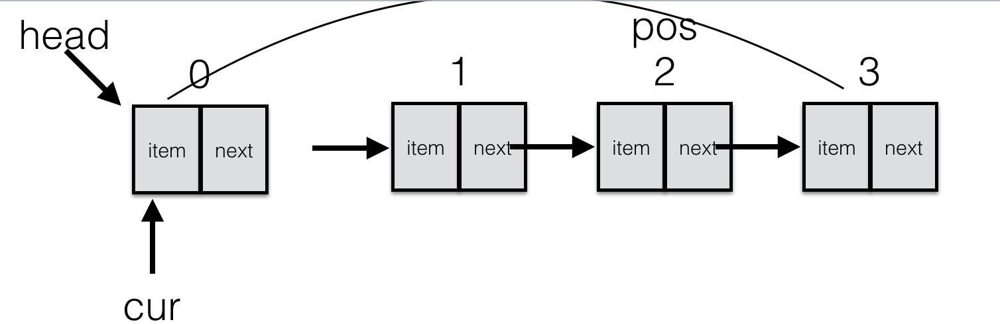

# 企业面试题

1. 自己实现单向循环链表  并实现以下功能

   > - is_empty() 链表是否为空
   > - length() 链表长度
   > - travel() 遍历整个链表
   > - add(item) 链表头部添加元素
   > - append(item) 链表尾部添加元素
   > - insert(pos, item) 指定位置添加元素
   > - remove(item) 删除节点
   > - search(item) 查找节点是否存在 

**链表示意图如下:**

