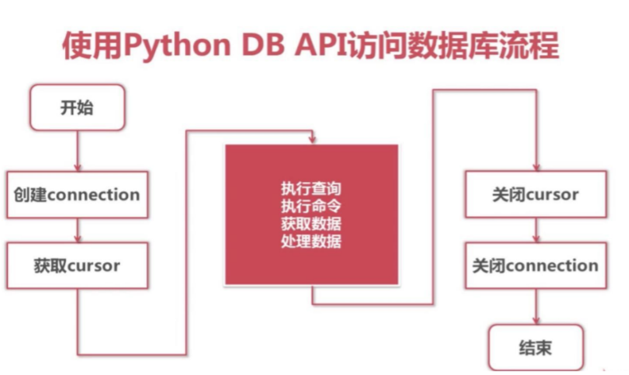

# 企业笔试题

1. Python 中操作 Mysql 步骤

   

   代码实现:

   ```python
   #首先安装包-pymysql sudo pip install pymysql
   #之后在程序中调用 from pymysql import * 
   ''' connection 对象 用于建立与数据库的连接 创建对象：调用 connect()方法 ''' 
   conn = connect(参数列表）
   ''' 参数列表：
   host:连接 MySQL 主机，如果是本机则为”localhost“
   port:连接 MySQL 主机端口，默认 3306
   database:数据库名称
   user：连接的用户名
   password：连接的密码
   charset:通信采用的编码方式，推荐采用 utf8
   ''' 
   ''' connection 对象方法
   close() 关闭连接
   commit() 提交
   rollback() 回滚
   cursor() 返回
   cursor 对象，用于执行 sql 语句
   例如：select,insert,update,delete ''' 
   cs1 = conn.cursor()
   ''' cursor 对象方法
   close() 关闭
   execute(operation[,parameters])执行语句，返回受影响的行数，主要用于执行 insert、update、delete 语句，
   也可以执行 create、alter、drop 等语句
   fetchone()执行查询语句时，获取查询结果集的第一个行数据，返回一个元组
   fetchall()执行查询时，获取结果集的所有行，一行构成一个元组，再将这些元组装入一个元组返回 ''' 
                  
   ''' 
   cursor 对象属性
   rowcount 只读属性，表示最近一次
   execute()执行后受影响的行数
   connection 获得当前连接对象 ''' 
   #例子
   #创建 Connection 连接
   conn = connect(host='localhost', port=3306, user='root', password='mysql', database='python1', charset='utf8')
   #获得 Cursor 对象 
   cs = conn.cursor()
   # 更新 
   # sql = 'update students set name="刘邦" where id=6' 
   #删除
   # sql = 'delete from students where id=6' 
   #执行 select 语句，并返回受影响的行数：查询一条学生数据
   sql = 'select id,name from students where id = 7' 
   # sql = 'SELECT id,name FROM students WHERE id = 7' 
   count=cs.execute(sql)
   #打印受影响的行数
   print count
   ```

   ​

2. Sql 注入是如何产生的，如何防止？

   程序开发过程中不注意规范书写 sql 语句和对特殊字符进行过滤，导致客户端可以通过全局变量
   POST 和 GET 提交一些 sql 语句正常执行。产生 Sql 注入。下面是防止办法：
   a. 过滤掉一些常见的数据库操作关键字，或者通过系统函数来进行过滤。
   b. 在 PHP 配置文件中将 Register_globals=off;设置为关闭状态
   c. SQL 语句书写的时候尽量不要省略小引号(tab 键上面那个)和单引号
   d. 提高数据库命名技巧，对于一些重要的字段根据程序的特点命名，取不易被猜到的
   e. 对于常用的方法加以封装，避免直接暴漏 SQL 语句
   f. 开启 PHP 安全模式：Safe_mode=on;
   g. 打开 magic_quotes_gpc 来防止 SQL 注入
   h. 控制错误信息：关闭错误提示信息，将错误信息写到系统日志。
   i. 使用 mysqli 或 pdo 预处理。

3. Mysql 数据库中怎么实现分页？

   select * from table limit (start-1)*limit,limit; 其中 start 是页码，limit 是每页显示的条数。

4. 数据库的设计？

   第一范式：数据库表的每一列都是不可分割的原子数据项，即列不可拆分。
   第二范式：建立在第一范式的基础上，要求数据库表中的每个实例或记录必须是可以唯一被区分的，
   即唯一标识。
   第三范式：建立在第二范式的基础上，任何非主属性不依赖与其他非主属性，即引用主键。

   ​

   ​
